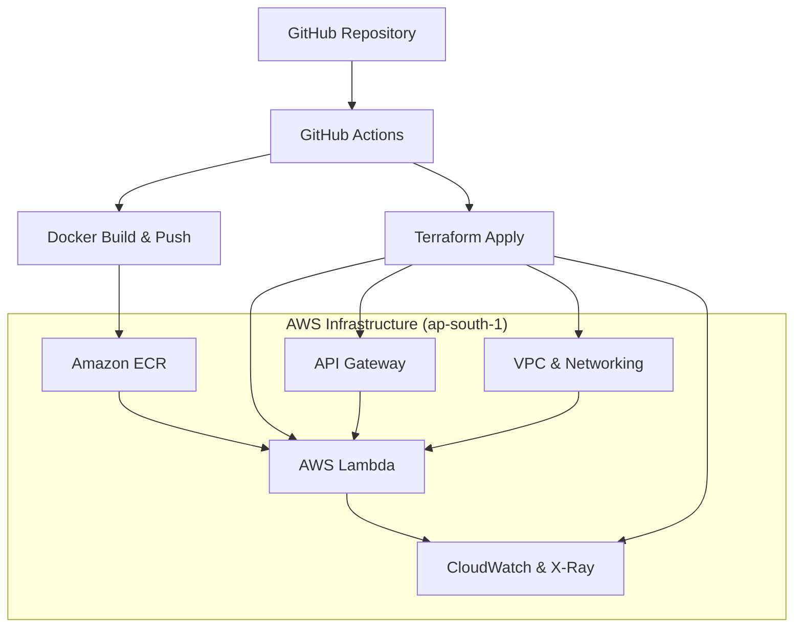

# AWS Lambda Container DevOps Solution

## Overview

This project demonstrates a complete DevOps solution for deploying containerized applications to AWS Lambda using Infrastructure as Code (Terraform), CI/CD pipelines (GitHub Actions), and container deployment strategies.

## Architecture



## Project Structure

```
.
├── .github/
│   └── workflows/
│       ├── ecr.yml
│       ├── build-deploy.yml
│       └── destroy-infrastructure.yml
├── terraform/
│   ├── environments/
│   │   ├── dev/
│   │   ├── staging/
│   │   └── prod/
│   └── modules/
│       ├── vpc/
│       ├── ecr/
│       ├── lambda/
│       ├── api-gateway/
│       └── monitoring/
├── src/
│   ├── app.py
│   ├── Dockerfile
│   ├── requirements.txt
│   └── test_lambda_local.py
└── docs/
    └── setup.md
```

## Prerequisites

1. AWS Account with appropriate permissions
2. GitHub repository with OIDC configured
3. Terraform >= 1.10.0
4. Docker

## Quick Start

1. **Configure GitHub OIDC**:
   - Set up AWS IAM Identity Provider for GitHub
   - Configure repository secrets

2. **Deploy Infrastructure**:
   ```bash
   cd terraform/environments/dev
   terraform init
   terraform plan
   terraform apply
   ```

3. **Build and Deploy Application**:
   - Push code to trigger GitHub Actions
   - Monitor deployment in AWS Console

## Environment Configuration

- **dev**: Development environment with minimal resources
- **staging**: Pre-production environment mirroring production
- **prod**: Production environment with high availability

## Monitoring

- **CloudWatch Logs**: Lambda function logs
- **CloudWatch Metrics**: Performance metrics

## Security Features

- OIDC authentication for GitHub Actions
- Least privilege IAM policies
- VPC isolation
- Security groups with minimal access
- Encrypted S3 state backend
